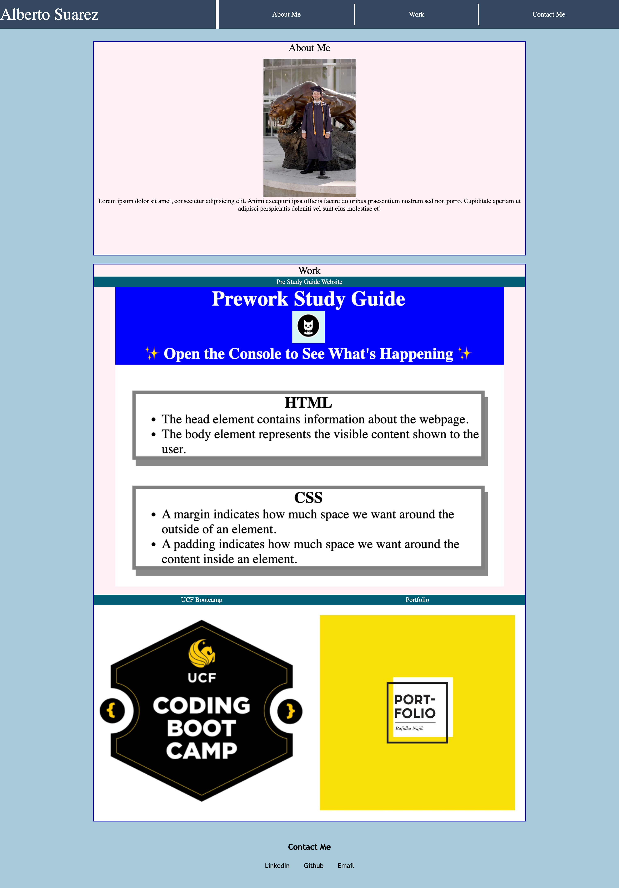

# Module-2-Challenge

## Description

This website is a portfolio containing information on how to contact me and links to all my deployed applications. I built this website so it would be easily accessible to see my progress throughout my developer career. I learned many things including how to program a website specifically for users of different platforms (Mobile, Tablet, and/or Desktop). I also purposefully built my website with the intention for it to work on mobile first and slowly built it up to Desktop. With that in mind, I was able to utilize different display properties and lessen my media queries to an appropriate amount. I intend to continue updating this portfolio as I learn new skills and deploy more applications.

## Deployed Website

The following is a screenshot and url of the deployed website: 

- https://albertosuarez8.github.io/Module-2-Challenge/